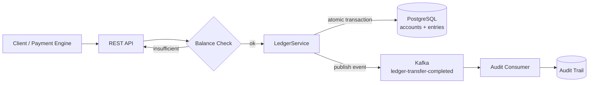
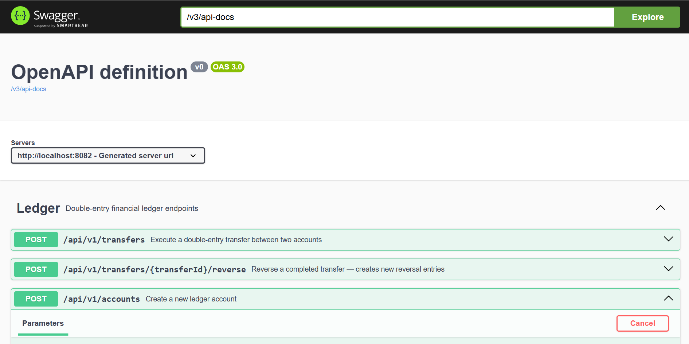
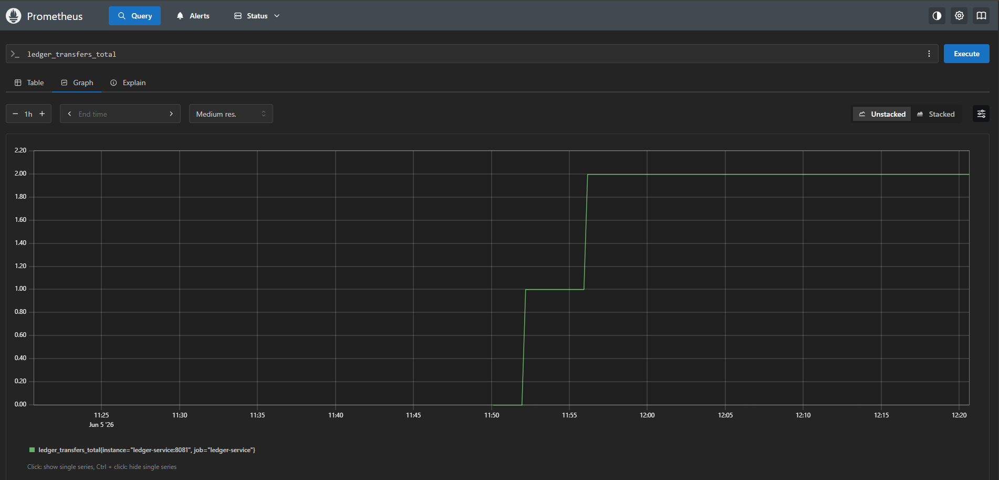
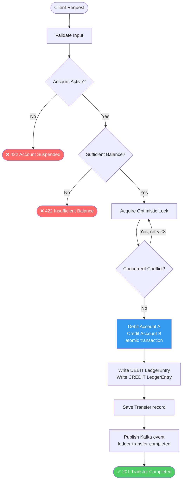
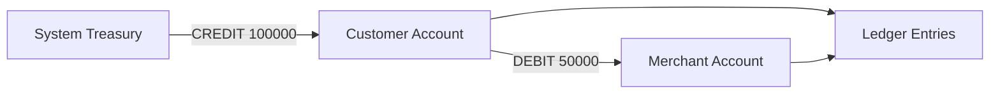

# Transaction Ledger Service

A production-grade double-entry financial ledger built with Java 17, Spring Boot, Kafka, and PostgreSQL.


---

## What is a Ledger?

A ledger is the financial source of truth. Every debit and credit is recorded as an immutable entry. The current balance of any account is derived by summing its entries never stored directly.

This is double-entry bookkeeping: **every debit has a matching credit**. Money doesn't appear or disappear it moves between accounts.

---

## Architecture



---

## Screenshots

### Swagger UI



### Prometheus Metrics



---

## Key Design Decisions

### Why Double-Entry Bookkeeping?
Every financial operation produces two entries: a debit on one account and a credit on another. This makes the ledger self-balancing and makes errors immediately detectable. The sum of all debits always equals the sum of all credits.

### Why Immutable Entries?
Ledger entries are never updated or deleted. If a payment is reversed, a new reversal entry is created. This gives a complete, tamper-proof audit trail critical for compliance and reconciliation.

### Why Derived Balances?
Account balances are computed from the sum of entries, not stored as a mutable field. This prevents balance drift and makes the ledger the single source of truth. A balance snapshot is cached for performance.

### Why Optimistic Locking?
Concurrent transfers to the same account must not corrupt balances. Optimistic locking detects conflicts at commit time and retries no blocking, better throughput than pessimistic locks.

### Why Kafka?
Ledger events (debit, credit, reversal) are published to Kafka so downstream services (audit, reporting, notifications) can react without coupling to the ledger.

### Why PostgreSQL?
ACID transactions are non-negotiable for financial data. The debit and credit entries of a transfer are written atomically either both succeed or neither does.

---

## Tech Stack

| Layer | Technology |
|---|---|
| Language | Java 17 |
| Framework | Spring Boot 3.2 |
| Database | PostgreSQL 15 |
| Messaging | Apache Kafka |
| Observability | Micrometer + Prometheus |
| API Docs | OpenAPI 3 (Swagger UI) |
| Testing | JUnit 5 + Testcontainers |
| Containerization | Docker + Docker Compose |
| Orchestration | Kubernetes |

---
## Business Rules

The ledger enforces the following invariants:

- Every transfer produces exactly one DEBIT and one CREDIT entry.
- Total debits must always equal total credits.
- Ledger entries are immutable.
- Transfers cannot exceed available balance.
- Reversals generate new compensating entries instead of modifying existing ones.
- All transfer operations are executed atomically.
---

## Getting Started

```bash
git clone https://github.com/babacar-niang/transaction-ledger-service
cd transaction-ledger-service
docker-compose up --build
```

- API: `http://localhost:8082`
- Swagger UI: `http://localhost:8082/swagger-ui/index.html`
- Prometheus: `http://localhost:9091`
- Kafka: `http://localhost:9093`
- PostgreSQL: `http://localhost:5433`

---

## Demo Scenario

Full lifecycle in 7 steps run against `docker-compose up`:

```bash
# 1. Create customer account
curl -X POST http://localhost:8082/api/v1/accounts \
  -H "Content-Type: application/json" \
  -d '{"ownerId":"customer_A","currency":"XOF","type":"CUSTOMER"}'

# 2. Fund account with 100,000 XOF from system treasury
curl -X POST http://localhost:8082/api/v1/accounts/{accountId}/fund \
  -H "Content-Type: application/json" \
  -d '{"amount":100000,"reference":"INITIAL_FUNDING"}'

# 3. Create merchant account
curl -X POST http://localhost:8082/api/v1/accounts \
  -H "Content-Type: application/json" \
  -d '{"ownerId":"merchant_B","currency":"XOF","type":"MERCHANT"}'

# 4. Transfer 50,000 XOF to merchant
curl -X POST http://localhost:8082/api/v1/transfers \
  -H "Content-Type: application/json" \
  -d '{"debitAccountId":"{customerAccountId}","creditAccountId":"{merchantAccountId}","amount":50000,"currency":"XOF","reference":"PAY-001"}'

# 5. Check balances
curl http://localhost:8082/api/v1/accounts/{customerAccountId}/balance
curl http://localhost:8082/api/v1/accounts/{merchantAccountId}/balance

# 6. View full audit trail
curl http://localhost:8082/api/v1/accounts/{customerAccountId}/entries

# 7. Reverse the transfer
curl -X POST http://localhost:8082/api/v1/transfers/{transferId}/reverse \
  -H "Content-Type: application/json" \
  -d '{"reason":"Customer dispute"}'
```

---

## API Reference

### Create Account

```
POST /api/v1/accounts
{
  "ownerId": "user_123",
  "currency": "XOF",
  "type": "CUSTOMER"
}
```

### Fund Account (from system treasury)

```
POST /api/v1/accounts/{accountId}/fund
{
  "amount": 100000,
  "reference": "INITIAL_FUNDING"
}
```

Credits the account via a real double-entry transfer from `SYSTEM_TREASURY`.
The treasury account is created automatically on first use.

### Get Balance

```
GET /api/v1/accounts/{accountId}/balance
```

### Transfer (Debit + Credit atomically)

```
POST /api/v1/transfers
{
  "debitAccountId": "acc_123",
  "creditAccountId": "acc_456",
  "amount": 50000,
  "currency": "XOF",
  "reference": "PAY-001",
  "description": "Payment for invoice INV-2024-001"
}
```

### Account History (Audit Trail)

```
GET /api/v1/accounts/{accountId}/entries
GET /api/v1/accounts/{accountId}/entries?type=DEBIT
GET /api/v1/accounts/{accountId}/entries?from=2024-01-01&to=2024-12-31
```

### Reverse a Transfer

```
POST /api/v1/transfers/{transferId}/reverse
{
  "reason": "Customer dispute - refund approved"
}
```

---

## Double-Entry Example

A transfer of 50,000 XOF from Account A to Account B produces:

```
┌─────────────────────────────────────────────────────────────┐
│  Transfer: TRF-001                                          │
├──────────────┬────────────┬──────────────┬──────────────────┤
│  Account     │  Type      │  Amount      │  Balance After   │
├──────────────┼────────────┼──────────────┼──────────────────┤
│  Account A   │  DEBIT     │  50,000 XOF  │  450,000 XOF     │
│  Account B   │  CREDIT    │  50,000 XOF  │  150,000 XOF     │
└──────────────┴────────────┴──────────────┴──────────────────┘

Ledger balance check: Total debits = Total credits 
```

---

## Transfer Lifecycle



**Invariant:** every completed transfer produces exactly 2 ledger entries — one DEBIT, one CREDIT. The sum of all debits always equals the sum of all credits.

## Audit Trail Example



---

## Observability

Metrics at `/actuator/prometheus`:
- `ledger_transfers_total`
- `ledger_transfers_failed_total`
- `ledger_reversals_total`
- `ledger_entries_created_total`

---

## Testing

```bash
cd ledger-service
./mvnw test
```

Tests use **Testcontainers** — no local setup needed.

Coverage includes:
- Double-entry integrity (debit = credit)
- Concurrent transfer safety (optimistic locking)
- Insufficient balance rejection
- Transfer reversal
- Audit trail completeness

---

## Project Structure

```
transaction-ledger-service/
├── ledger-service/
│   ├── src/main/java/com/babacar/ledger/
│   │   ├── api/           # REST controllers + exception handler
│   │   ├── domain/        # Entities + enums
│   │   ├── service/       # Business logic + repositories
│   │   │   └── dto/       # Request + response DTOs
│   │   ├── kafka/         # Event producer
│   │   └── observability/ # Custom Micrometer metrics
│   └── src/test/          # Integration tests (Testcontainers)
├── k8s/                   # Kubernetes manifests
├── docs/                  # Prometheus config
└── docker-compose.yml
```

---

## Related Project

This service is the financial source of truth layer for the [Fintech Payment Engine](https://github.com/babacar-niang/fintech-payment-engine).

Current state:
Payment Engine and Ledger Service are developed independently.

Next milestone:
Payment Engine → Kafka → Ledger Service

The ledger will become the financial source of truth for all processed payments.


---
## Concurrency & Safety

The ledger is safe under concurrent access.
The following test fires 10 simultaneous transfers against the same account:

```
10 threads × 10,000 XOF = 100,000 XOF total debited
Starting balance:  500,000 XOF
Expected balance:  400,000 XOF
```

Optimistic locking (`@Version` on `Account`) detects conflicts at commit time
and retries — no blocking, no corruption, no double-spend.

Run it:
```bash
./mvnw test -Dtest=LedgerIntegrationTest#concurrentTransfers_optimisticLocking_balanceConsistent
```
---
## Future Improvements

- Consume PaymentCreated events from Fintech Payment Engine
- Transaction Outbox Pattern
- Multi-currency ledger support
- Account freezing / suspension
- Ledger reconciliation jobs
- OpenTelemetry distributed tracing
- Helm chart deployment

---

## Author

**Babacar Niang** Senior Backend Engineer · Financial Infrastructure · Distributed Systems

[LinkedIn](https://linkedin.com/in/babacar-niang-swe) · [GitHub](https://github.com/babacar-niang)
